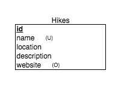

# Hiking Buddy

## Boston area hiking app to find recommended trails to go on.

### To run locally, set up two command lines and do the following from the root directory:

Tab 1
```
cd frontend
npm install && bower install
ember serve --proxy http://localhost:3000
```
Tab 2
```
cd backend
bundle install
rake db:create db:migrate db:seed
rails server
```

Then go to ```localhost:4200``` and explore the fun trails available!


### ER Diagram



### Future Updates

* Create User model
* Create Search model
